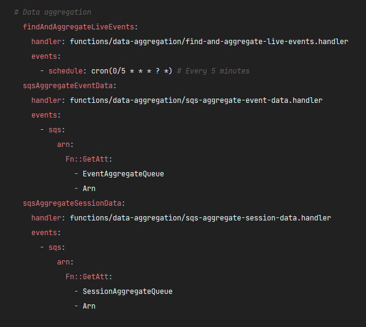

## Aggregation

---

Apart from client generated heartbeats every 30 seconds, we also aggregate data on a 5 minutes
interval.

Relevant excerpt from `nwv2-api-analytics`'s `serverless.yml`:

{: style="height:auto;width:auto"}

Feel free to look inside the function to gain a sense of what it does.

In short, it does the following things, one after the other:

### `findAndAggregateLiveEvents`

This is the function that gets run every 5 minutes, it finds all events with live viewers(defined as
be any events with activities within the last 5 minutes), and sends them down an SQS queue, one
which is subscribed by a lambda function.

### `sqsAggregateEventData`

This is the consumer for the said queue in the last section.

It aggregates the data collected, and enables the following metrics:

#### Max Concurrent Viewers

Count the number of active users within the past 5 minutes, and tries to update DB record if larger.

#### Total Attended Viewers

Much like the last one, get a count of all viewers who has logged in at least once, and tries to
update DB record, if larger.

#### Event Stats

Please refer to [heartbeats chapter](./heartbeats.md#Event Statistics) for a description of this.

Gets a list of stats records within the past 5 minutes, aggregates them, and writes to DB.

After aggregating data for events, it moves on the find sessions with live viewers in the past 5
minutes, and sends them down the line to be processed by another function.

### `sqsAggregateSessionData`

Does pretry much the exact same thing as `sqsAggregateEventData` except scoped to sessions.
