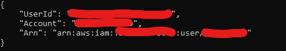

## Prerequisites

---

### [AWS CLI](https://aws.amazon.com/cli/){target=_blank}

Please make sure you have the following ready:

- A valid set of credentials that has the necessary permissions.
- A profile named *nwv2Admin* (Optional, but recommended. This is the default profile our SLS stacks use for deployment.)

Try running this command after setup:

```shell
aws sts get-caller-identity --profile nwv2Admin
```

You should get a response similar to this one:

{: style="height:100px;width:auto"}

### Node

Not much can be said about this one.

Most newer versions should work.

Verified versions:
- v15.5.1 (CICD Server is running this)
- v12.22.1

### Serverless Framework

[Official Getting Started page](https://www.serverless.com/framework/docs/getting-started){target=_blank}.

In any case, it is recommended to install with NPM:

```shell
npm install -g serverless
```

Run this to verify that it works:

```shell
sls --version
```

`sls` is simply a shortcut for the `serverless` command.


