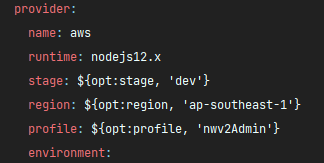
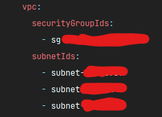

## Lambda/API Deployment

---

### Get Ready

Before we begin, ensure that you've obtained a copy of the ENV variables required for all API stacks.

They are named as such:

- `.env.<STAGE_NAME>.json`
- `.secrets.<STAGE_NAME>.json`

And they look somewhat like this:

{: style="height:auto;width:auto"}

{: style="height:auto;width:auto"}

### Deployment Order

The API stacks can be deployed in any order **except for 2 of them**!

And they are:

- `nwv2-api-admin-iam` and
- `nwv2-api-viewer-auth`

They need to be deployed first, in no particular order.

The reason for that is they contain declarations to 2 authorizer functions that are imported and used
in almost all other stacks.

Relevant excerpts from `nwv2-api-admin-iam`'s `serverless.yml`:

{: style="height:auto;width:auto"}

{: style="height:auto;width:auto"}

### Deploy

We'll use `nwv2-api-admin-iam` as an example.

Change directory into the project root, run:

```shell
npm install
```

After which an npm `postinstall` script will be automatically triggered, the scripts simply goes into
a submodule's folder and run install from within, and then run a TypeScript transpiler.

Make sure both env files are placed under project root.

(The `nwv2-api-admin-iam` stack actually only requires one, but it doesn't hurt.)

Now for the actual deployment, run:

```shell
sls deploy --stage <STAGE_NAME>
# for example: sls deploy --stage dev
```

If deploying with a different AWSCLI profile:

```shell
sls deploy --stage <STAGE_NAME> --profile <PROFILE_NAME>
# for example: sls deploy --stage dev --profile someguy
```

Or even to a different region:

```shell
sls deploy --stage <STAGE_NAME> --profile <PROFILE_NAME> --region <REGION_CODE>
# for example: sls deploy --stage dev --profile someguy --region ap-southeast-1
```

If any of these variables are not provided, the following defaults will be used instead:

- stage: `dev`
- profile: `nwv2Admin`
    - This is why we recommend naming your credential `nwv2Admin`.
- region: `ap-southeast-1`

Relevant excerpt:

{: style="height:auto;width:auto"}

Example output from a successful deployment:

```shell
.
.
.
functions:
  sharedAdminAuthorizer: novaweb-api-admin-iam-dev-sharedAdminAuthorizer
  createUser: novaweb-api-admin-iam-dev-createUser
  deleteUser: novaweb-api-admin-iam-dev-deleteUser
  getUsers: novaweb-api-admin-iam-dev-getUsers
  updateUser: novaweb-api-admin-iam-dev-updateUser
  authenticate: novaweb-api-admin-iam-dev-authenticate
  triggerPasswordReset: novaweb-api-admin-iam-dev-triggerPasswordReset
  passwordReset: novaweb-api-admin-iam-dev-passwordReset
  logout: novaweb-api-admin-iam-dev-logout
layers:
  None
Serverless: Removing old service artifacts from S3...
```

Rinse and repeat.

### Important (`nwv2-api-analytics`)

Although you should be able to deploy all 7 API stacks successfully just by doing the above, there's
one caveat.

Our analytics stack `nwv2-api-analytics` contains references to AWS resources created neither
by the CDK nor the Serverless Stacks.

The resources being referred to are:

- A VPC with:
    - A security group, and
    - A couple attached subnets
- A Redis database created inside the above VPC
- VPC Endpoints for the following resources:
    - DynamoDB (Gateway endpoint)
    - S3 (Gateway endpoint)
    - SQS (Interface endpoint)
    
Relevant excerpt:

{: style="height:auto;width:auto"}

{: style="height:auto;width:auto"}
