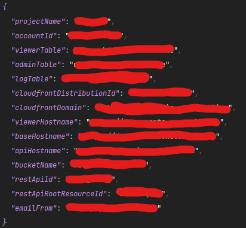
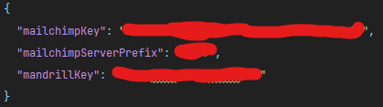
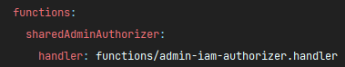
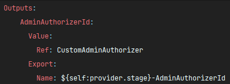

## Deployment

---

### Get Ready

Before we begin, ensure that you've obtained a copy of the ENV variables required for all API stacks.

They are named as such:

- `.env.<STAGE_NAME>.json`
- `.secrets.<STAGE_NAME>.json`

And they look somewhat like this:

{: style="height:auto;width:auto"}

{: style="height:auto;width:auto"}

### Important Reminder

The API stacks can be deployed in any order **except for 2 of them**!

And they are:

- `nwv2-api-admin-iam` and
- `nwv2-api-viewer-auth`

They need to be deployed first, in no particular order.

The reason for that is they contain declarations to 2 authorizer functions that are imported and used
in almost all other stacks.

Relevant excerpts from `nwv2-api-admin-iam`'s `serverless.yml`:

{: style="height:auto;width:auto"}

{: style="height:auto;width:auto"}

### Deploy

We'll use `nwv2-api-admin-iam` as an example.

Change directory into the project root, run:

```shell
npm install
```

After which an npm `postinstall` script will be automatically triggered, the scripts simply goes into
a submodule's folder and run install from within, and then run a TypeScript transpiler.

Make sure both env files are placed under project root.

(The `nwv2-api-admin-iam` stack actually only requires one, but it doesn't hurt.)

Now for the actual deployment, run:

```shell
sls deploy --stage <STAGE_NAME>
# for example: sls deploy --stage dev
```

Example output from a successful deployment:

```shell
Serverless: Deprecation warning: CLI options definitions were upgraded with "type" property (which could be one of "string", "boolean", "multiple"). Below listed plugins do not predefine type for introduced options:
             - ServerlessPlugin for "out"
            Please report this issue in plugin issue tracker.
            Starting with next major release, this will be communicated with a thrown error.
            More Info: https://www.serverless.com/framework/docs/deprecations/#CLI_OPTIONS_SCHEMA
Serverless: Deprecation warning: "provider.profile" is not accessible (configured behind variables which cannot be resolved at this stage).
            Starting with next major release, this will be communicated with a thrown error.
            Set "variablesResolutionMode: 20210326" in your service config, to adapt to this behavior now
            More Info: https://www.serverless.com/framework/docs/deprecations/#NEW_VARIABLES_RESOLVER
Serverless: Configuration warning:
Serverless:   at 'functions.createUser.events[0].http.authorizer.type': unsupported configuration format
Serverless:   at 'functions.deleteUser.events[0].http.authorizer.type': unsupported configuration format
Serverless:   at 'functions.getUsers.events[0].http.authorizer.type': unsupported configuration format
Serverless:   at 'functions.updateUser.events[0].http.authorizer.type': unsupported configuration format
Serverless:   at 'functions.logout.events[0].http.authorizer.type': unsupported configuration format
Serverless:  
Serverless: Learn more about configuration validation here: http://slss.io/configuration-validation
Serverless:  
Serverless: Deprecation warning: Starting with next major, Serverless will throw on configuration errors by default. Adapt to this behavior now by adding "configValidationMode: error" to service configuration
            More Info: https://www.serverless.com/framework/docs/deprecations/#CONFIG_VALIDATION_MODE_DEFAULT
Serverless: Deprecation warning: Starting with version 3.0.0, following property will be replaced:
              "provider.iamRoleStatements" -> "provider.iam.role.statements"
            More Info: https://www.serverless.com/framework/docs/deprecations/#PROVIDER_IAM_SETTINGS
Serverless: Deprecation warning: Resolution of lambda version hashes was improved with better algorithm, which will be used in next major release.
            Switch to it now by setting "provider.lambdaHashingVersion" to "20201221"
            More Info: https://www.serverless.com/framework/docs/deprecations/#LAMBDA_HASHING_VERSION_V2
Serverless: Bundling with Webpack...
Serverless: No external modules needed
Serverless: Packaging service...
Serverless: Uploading CloudFormation file to S3...
Serverless: Uploading artifacts...
Serverless: Uploading service sharedAdminAuthorizer.zip file to S3 (95.37 KB)...
Serverless: Uploading service createUser.zip file to S3 (146.73 KB)...
Serverless: Uploading service deleteUser.zip file to S3 (144.48 KB)...
Serverless: Uploading service logout.zip file to S3 (95.6 KB)...
Serverless: Uploading service passwordReset.zip file to S3 (138.28 KB)...
Serverless: Uploading service triggerPasswordReset.zip file to S3 (150.21 KB)...
Serverless: Uploading service authenticate.zip file to S3 (144.67 KB)...
Serverless: Uploading service updateUser.zip file to S3 (138.63 KB)...
Serverless: Uploading service getUsers.zip file to S3 (138.32 KB)...
Serverless: Validating template...
Serverless: Updating Stack...
Serverless: Checking Stack update progress...
..............................................................
Serverless: Stack update finished...
Service Information
service: novaweb-api-admin-iam
stage: dev
region: ap-southeast-1
stack: novaweb-api-admin-iam-dev
resources: 62
api keys:
  None
endpoints:
  POST - https://cenugritej.execute-api.ap-southeast-1.amazonaws.com/dev/admin-iam/users
  DELETE - https://cenugritej.execute-api.ap-southeast-1.amazonaws.com/dev/admin-iam/users/{userId}
  GET - https://cenugritej.execute-api.ap-southeast-1.amazonaws.com/dev/admin-iam/users
  POST - https://cenugritej.execute-api.ap-southeast-1.amazonaws.com/dev/admin-iam/users/{userId}
  POST - https://cenugritej.execute-api.ap-southeast-1.amazonaws.com/dev/admin-iam/authenticate
  POST - https://cenugritej.execute-api.ap-southeast-1.amazonaws.com/dev/admin-iam/password-reset-trigger
  POST - https://cenugritej.execute-api.ap-southeast-1.amazonaws.com/dev/admin-iam/password-reset
  POST - https://cenugritej.execute-api.ap-southeast-1.amazonaws.com/dev/admin-iam/logout
functions:
  sharedAdminAuthorizer: novaweb-api-admin-iam-dev-sharedAdminAuthorizer
  createUser: novaweb-api-admin-iam-dev-createUser
  deleteUser: novaweb-api-admin-iam-dev-deleteUser
  getUsers: novaweb-api-admin-iam-dev-getUsers
  updateUser: novaweb-api-admin-iam-dev-updateUser
  authenticate: novaweb-api-admin-iam-dev-authenticate
  triggerPasswordReset: novaweb-api-admin-iam-dev-triggerPasswordReset
  passwordReset: novaweb-api-admin-iam-dev-passwordReset
  logout: novaweb-api-admin-iam-dev-logout
layers:
  None
Serverless: Removing old service artifacts from S3...
```
