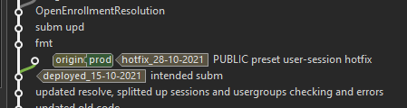
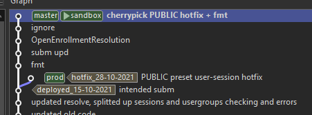
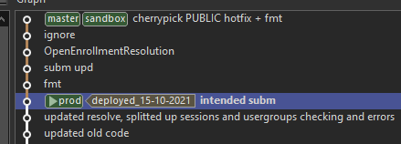
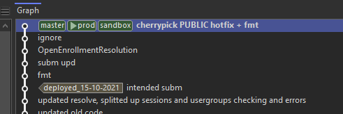

## Deployment Procedures(Environments)

---

### `dev`

Deployments to the `dev` stage(and all other personal stages) is governed mainly by common sense.

Sometimes you'd deploy local changes, sometimes a full stack deploy, sometimes only one lambda
function is deployed.

Just be a good sport and talk to your colleagues before doing something that might influence their
workflow.

If you plan to break things and cleanse DB often, try to do it in your own environment.

Each night, our CICD pipeline will redeploy and overwrite the `dev` stage with code on all `master`
branches. This exists to catch compile time errors early and reset any personal changes that are not
pushed and exist only on your local repositories.

After a nightly deployment, a jmeter integration test script will be run against the newly deployed
stage, in order to catch runtime errors and mistakes early.

More info on this in a later chapter.

### `sandbox`

Do not deploy local and makeshift changes to this stage.

All changes should be deployed from the `sandbox` branch, having been preliminarily tested by
developers.

Changes should be merged to `sandbox` from `master`, and should be fast forward merges only.

Ex: `git merge master --ff-only`.

### `prod`

Deployment should only be made to `prod` after the current `sandbox` version is passed by the QA
team and deemed ready for production, and a right time is found for deployment.

Do not deploying local and makeshift changes to this stage.

Again, deployments are made from the `prod` branch, which should be merged from `sandbox`, fast
forward only.

Occasionally, bugs will be found, some will be critical(completely breaks user experience). When
that happens, discuss with your leads and determine whether or not this is a bug that warrants
immediate action. The goal should be to avoid making makeshift hotfixes, see if it can wait for the
next deployment.

In that case that it can't wait, fixes should be made and committed and deployed to `prod` directly.
This will result in `prod` having commits that are not on `dev` nor `sandbox`, and will look
something like this:

{: style="height:auto;width:auto"}

This means the next merge from `sandbox` to `prod` cannot be a fast forward. In cases like this,
avoid merging backwards from `prod` to `dev`, as that dirties the commit history and creates
confusion. Cherry-pick the change to `dev`, and in the next production deployment cycle, reset
the `prod` branch, remove the offending commit, and once again merge from `sandbox`, fast forward
only. Afterwards, perform a force push to reset the commit history.

Cherry-pick the hotfix:

{: style="height:auto;width:auto"}

Reset `prod`:

{: style="height:auto;width:auto"}

Fast forward and force push:

{: style="height:auto;width:auto"}
