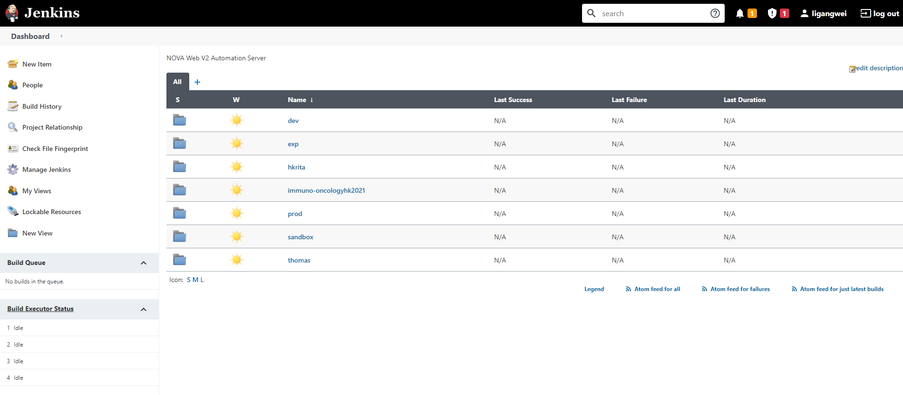

## Deployment QOL

---

### Automation

Since we have 7 api projects and 4 site project(so far).

Merging and deploying 11 projects everytime a deployment is made, not to mention having to properly
remember and manage different env secrets, giving the proper cli stage variables, is not only
tiresome, it's also prone to human errors.

Therefore, for deployment, we have a [Jenkins](https://jenkins.novaweb.live/){target=_blank} CICD
server at our disposal.

The details of our Jenkins server will be in another chapter.

Our Jenkins home page should look like this(after login):

{: style="height:auto;width:auto"}

Depending on your level of access, what you see may differ from this.

Navigate into a stage's folder, we'll take `sandbox` for instance:

{: style="height:auto;width:auto"}

And then press the play button on the project you wish to deploy:

{: style="height:auto;width:auto"}

It will copy the necessary env files over, together with api secrets for third party apis, install
required modules and deploy for you.

The script it runs looks a bit like this:

```shell
npm install

cp ~/nova-env/.env.<STAGE>.json $WORKSPACE/
cp ~/nova-env/.secrets.<STAGE>.json $WORKSPACE/

sls deploy --stage <STAGE> --profile default
```

Jobs can run concurrently, meaning you can safely press play on all 11 projects, and patiently let
it do its job.

Deployments are also done from their respective branch, therefore `sandbox` and `prod` deployments
should to an extent be idempotent.
