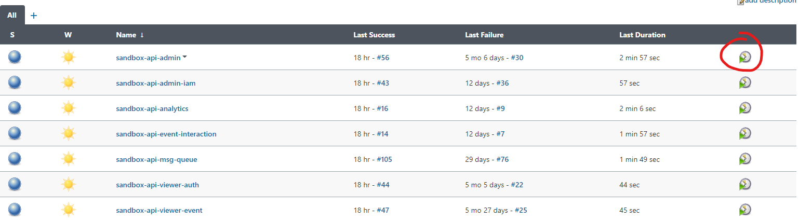

## Deployment QOL

---

### Automation

Since we have 7 api projects and 4 site project(so far).

Merging and deploying 11 projects everytime a deployment is made, not to mention having to properly
remember and manage different env secrets, giving the proper cli stage variables, is not only
tiresome, it's also prone to human errors.

Therefore, for deployment, we have a [Jenkins](https://jenkins.novaweb.live/){target=_blank} CICD
server at our disposal.

The details of our Jenkins server will be in another chapter.

Our Jenkins home page should look like this(after login):

{: style="height:auto;width:auto"}

Depending on your level of access, what you see may differ from this.

Navigate into a stage's folder, we'll take `sandbox` for instance:

{: style="height:auto;width:auto"}

And then press the play button on the project you wish to deploy:

{: style="height:auto;width:auto"}

It will copy the necessary env files over, together with api secrets for third party apis, install
required modules and deploy for you.

The script it runs looks a bit like this:

```shell
npm install

cp ~/nova-env/.env.<STAGE>.json $WORKSPACE/
cp ~/nova-env/.secrets.<STAGE>.json $WORKSPACE/

sls deploy --stage <STAGE> --profile default
```

Jobs can run concurrently, meaning you can safely press play on all 11 projects, and patiently let
it do its job.

Deployments are also done from their respective branch, therefore `sandbox` and `prod` deployments
should to an extent be idempotent.

### Recommended shell Scripts to Have

Even with the help of Jenkins, managing 11 git repositories is still somewhat a cognitively
demanding operation. Therefore, it is recommended to have a number of local bash scripts that can
help with your everyday tasks.

- Copies env files from server
    - Our envs are stored on the jenkins instance, if you have ssh access, you can conveniently copy
      them to your local environment with `scp`
    - example(all examples are in batch(windows)):

```bat
echo off

scp <server_domain>:~/nova-env/.env.*.json ./
scp <server_domain>:~/nova-env/.secrets.*.json ./

for /D %%i in ("*") do (
	xcopy .env.*.json %~dp0\%%i\ /Y
	xcopy .secrets.*.json %~dp0\%%i\ /Y
)

pause
```

- Merge current `master` to `sandbox`
    - This will be done about once a week, so it's immensely helpful if you don't need to merge and
      push all 11 projects manually
    - Example: (in batch)

```bat
echo off

for /D %%i in ("*") do (
	cd %~dp0%%i
	call git switch master --recurse-submodules --discard-changes
	call git pull --ff-only
	call git submodule update --init --recursive
	call git switch sandbox --recurse-submodules --discard-changes
	call git merge master --ff-only
	call git push
	call git switch master --recurse-submodules --discard-changes
)

pause
```

- Merge current `sandbox` to `prod`
    - This one goes without saying

- Update all submodules to the latest
    - This is not done very frequently, usually submodule\ versions are managed per projects, since
      every project is usually on a different submodule version, but on the rare occasions that you
      made substantial updates to the submodule and is updating submodules for all api projects
      frequently(a couple times a day), this is immensely helpful. 
