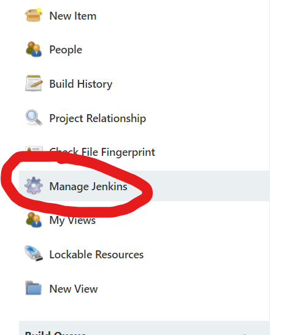
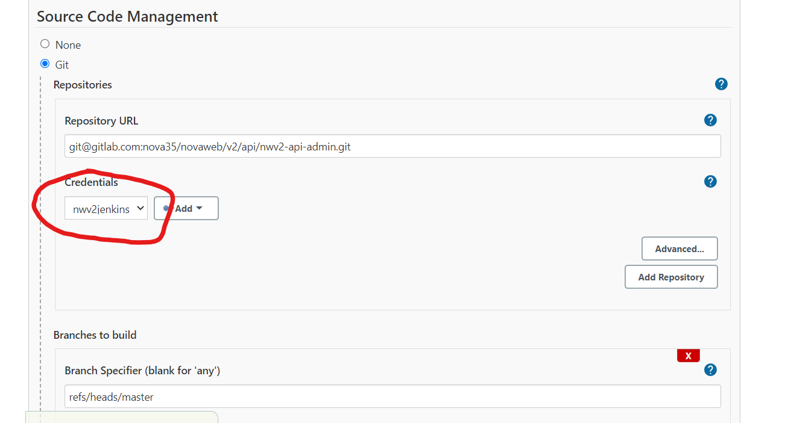
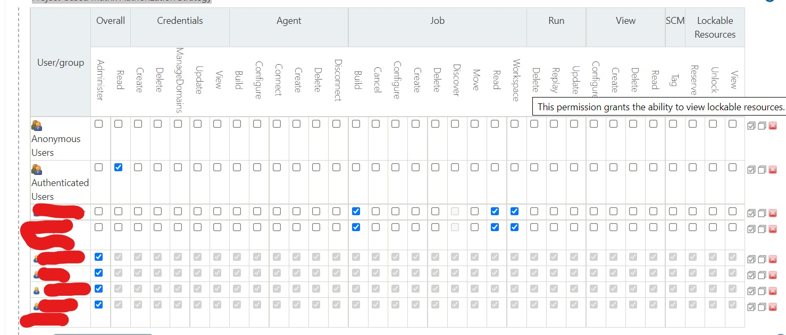

## Managing Jenkins

---

Creation and management of jobs is out of the scope of this guide, so that is something you'll have
to explore on your own.

This guide aims to cover certain configurations that may be vital to Jenkins being operational, and
where to find them.

If you have been granted administrative access, this button should be available to you:

This is where all management options are grouped under.

### Important

Barebones Jenkins is very configurable, but it does not provide a lot of QOL features.

It is very easy to mess up, accidentally delete jobs/users, provide wrong permission to the wrong
people, or simply just render the server unusable. So beware.

### Updating git Credentials

Git credentials(rsa ssh keys) can be found under:

*Manage Jenkins > Manage Credentials*

[Jenkins Doc](https://www.jenkins.io/doc/book/using/using-credentials/){target=_blank}

After which the key will be available for selection during jobs configuration:

### Access Control

*Manage Jenkins > Configure Global Security*

Under `Authorization`, make sure `Project-based Matrix Authorization Strategy` is checked.

You can hover over individual permissions to see a description of them.

This can be configured per jobs/folder as well.

**IMPORTANT!!**

Be careful not to remove administrative permission from yourself/everyone if it would result in no
one having admin rights. This is irreversible and Jenkins would be left without admins. The only way
to remedy this is to SSH into the instance, and reset Jenkins backing data store manually.

### Jenkins CLI

Jenkins provides a CLI for easier management when it comes to batch creating/updating jobs.

It can be done with `jenkins-cli.jar`, over `SSH`, `HTTP`, or even `Websockets`.

This makes jobs duplication a lot safer.

[Jenkins Doc](https://www.jenkins.io/doc/book/managing/cli/){target=_blank}

There are also libraries that wraps the CLI calls for you,
like [this one](https://www.npmjs.com/package/jenkins/v/0.28.0){target=_blank}.

Jenkins jobs are saved in `XML`, meaning you can export them and perform your choice of version
control if you so wish.

### New Users

There are 2 ways for adding new users:

1. *Manage Jenkins > Manage Users > Create User*
    - Provide username and password to users
    - Users can then set a new password by:
        - Clicking on their avatar icon on the top right
        - Click `Configure`
2. *Manage Jenkins > Configure Global Security*
    - Check `Allow users to sign up` under `Security Realm`

### Resetting a user's password

*Manage Jenkins > Manage Users > Select username > Configure*
